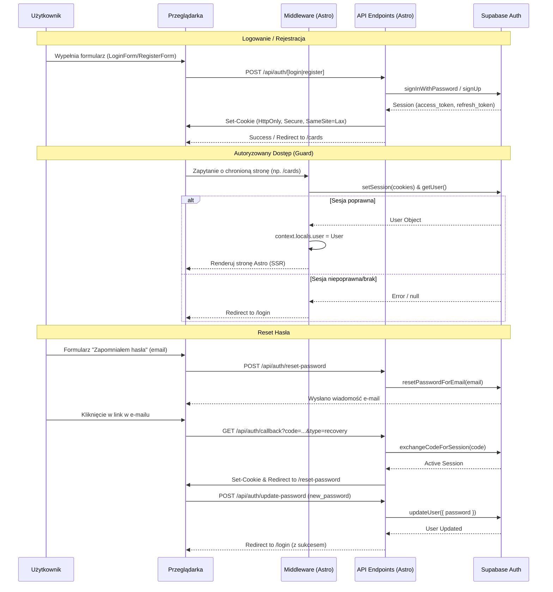
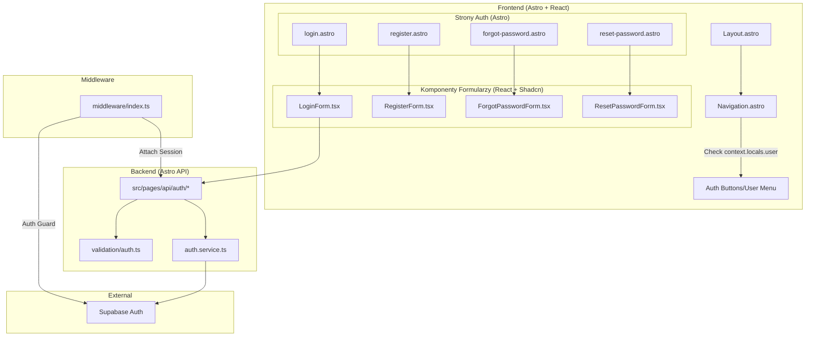

# Diagram Przepływu Autentykacji

Opracowano na podstawie `doc/prd.md` oraz `doc/auth_spec.md`.

## 1. Cykl życia sesji i dostęp do zasobów

```mermaid
sequenceDiagram
    participant U as Użytkownik
    participant B as Przeglądarka
    participant M as Middleware (Astro)
    participant API as API Endpoints (Astro)
    participant S as Supabase Auth

    Note over U, S: Logowanie / Rejestracja
    U->>B: Wypełnia formularz (LoginForm/RegisterForm)
    B->>API: POST /api/auth/[login|register]
    API->>S: signInWithPassword / signUp
    S-->>API: Session (access_token, refresh_token)
    API->>B: Set-Cookie (HttpOnly, Secure, SameSite=Lax)
    API-->>B: Success / Redirect to /cards
    
    Note over U, S: Autoryzowany Dostęp (Guard)
    B->>M: Zapytanie o chronioną stronę (np. /cards)
    M->>S: setSession(cookies) & getUser()
    alt Sesja poprawna
        S-->>M: User Object
        M->>M: context.locals.user = User
        M-->>B: Renderuj stronę Astro (SSR)
    else Sesja niepoprawna/brak
        S-->>M: Error / null
        M-->>B: Redirect to /login
    end

    Note over U, S: Reset Hasła
    U->>B: Formularz "Zapomniałem hasła" (email)
    B->>API: POST /api/auth/reset-password
    API->>S: resetPasswordForEmail(email)
    S-->>B: Wysłano wiadomość e-mail
    U->>B: Kliknięcie w link w e-mailu
    B->>API: GET /api/auth/callback?code=...&type=recovery
    API->>S: exchangeCodeForSession(code)
    S-->>API: Active Session
    API->>B: Set-Cookie & Redirect to /reset-password
    B->>API: POST /api/auth/update-password (new_password)
    API->>S: updateUser({ password })
    S-->>API: User Updated
    API-->>B: Redirect to /login (z sukcesem)
```

## 2. Architektura Komponentów

```mermaid
graph TD
    subgraph "Frontend (Astro + React)"
        L[Layout.astro]
        L --> Nav[Navigation.astro]
        Nav -->|Check context.locals.user| AuthNav[Auth Buttons/User Menu]
        
        subgraph "Strony Auth (Astro)"
            LoginPg[login.astro]
            RegPg[register.astro]
            ForgotPg[forgot-password.astro]
            ResetPg[reset-password.astro]
        end
        
        subgraph "Komponenty Formularzy (React + Shadcn)"
            LF[LoginForm.tsx]
            RF[RegisterForm.tsx]
            FPF[ForgotPasswordForm.tsx]
            RPF[ResetPasswordForm.tsx]
        end
        
        LoginPg --> LF
        RegPg --> RF
        ForgotPg --> FPF
        ResetPg --> RPF
    end

    subgraph "Backend (Astro API)"
        API[src/pages/api/auth/*]
        AS[auth.service.ts]
        VS[validation/auth.ts]
        API --> AS
        API --> VS
    end

    subgraph "Middleware"
        MW[middleware/index.ts]
    end

    subgraph "External"
        SBA[Supabase Auth]
    end

    LF --> API
    MW -->|Attach Session| API
    MW -->|Auth Guard| SBA
    AS --> SBA
```
